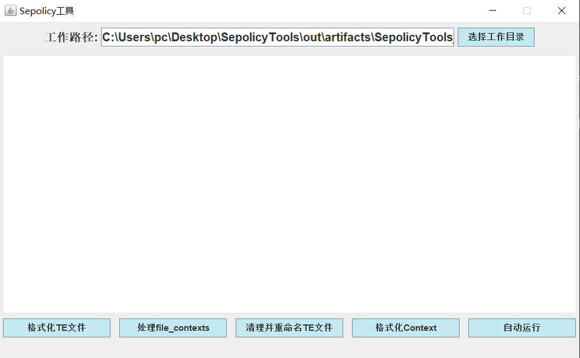

## 状态：还没写完

#### 这是什么东西？

一个能格式化Selinux 政策的工具

事情是这样的，我最近在修y67嘛

经过一番折腾，虽然能强制selinux了，不过就是，y67的sepolicy被我改得很乱，于是就写了这个工具

用来格式化sepolicy下的文件，顺便根据file_contexts与adb来判断哪些标签对应的文件是不存在的，然后删掉这些标签，再删掉相关的政策


#### 这东西能干嘛？

美化Sepolicy ~~其实没什么用~~

#### 使用步骤：

1、烧一壶开水

2、[下载软件](https://github.com/succerseng/SepolicyTools/releases) SepolicyTools.jar

3、烫洗茶杯

4、在终端运行

```sh
# 打开终端
# 进入下载文件目录
java -jar SepolicyTools.jar --encoding=utf-8
# 需要java执行环境 最好请使用java 8
```

5、洗茶

6、选择您的sepolicy文件夹

7、现在可以开始泡茶啦

8、连接您的手机

9、请注意 不要泡太久

10、点击自动运行

好了，您的茶快凉了，请尽快饮用吧

接下来只需要等着程序 ~~崩溃~~ 执行完成


