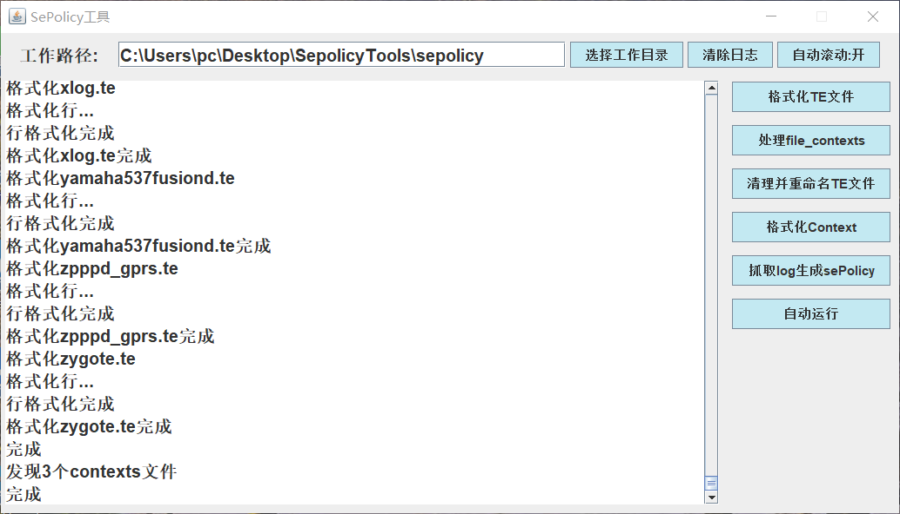

## 状态：还没写完

#### 这是什么东西？

一个能格式化Selinux 政策的工具

事情是这样的，我最近在修y67嘛

经过一番折腾，虽然能强制selinux了，不过就是，y67的sepolicy被我改得很乱，于是就写了这个工具

用来格式化sepolicy下的文件，顺便根据file_contexts与adb来判断哪些标签对应的文件是不存在的，然后删掉这些标签，再删掉相关的政策


#### 这东西能干嘛？

整理并美化Sepolicy ~~其实没什么用~~

#### 使用步骤：

1、[下载软件](https://github.com/succerseng/SepolicyTools/releases) SepolicyTools.jar

2、运行

```sh
java -jar SepolicyTools.jar --encoding=utf-8
```

3、设置sepolicy文件夹的路径

4、连接手机

5、点击自动运行

接下来只需要等着程序 ~~崩溃~~ 执行完成



